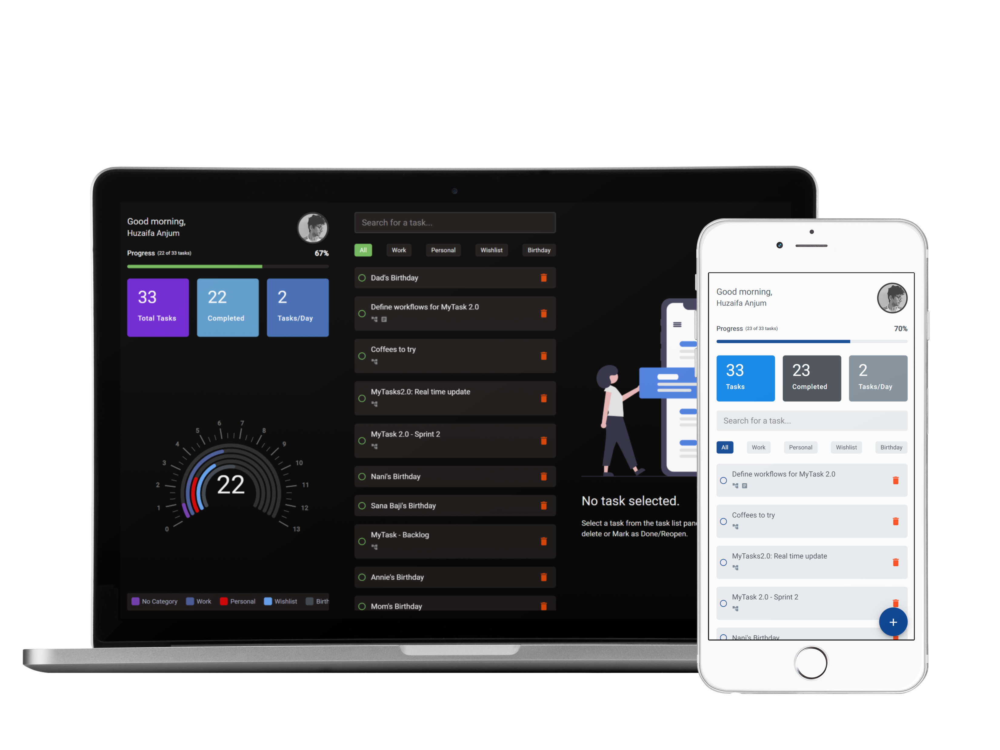

# MyTasks

## Table of Contents
- [Introduction](#introduction)
- [Features](#features)
- [Design](#design)
- [Getting Started](#getting-started)
  - [Prerequisites](#prerequisites)
  - [Install and Run](#install-and-run)
- [Build](#build)
- [App Installation](#app-installation)
- [Contributors](#contributors)
- [Contributing](#contributing)
- [License](#license)
- [Acknowledgements](#acknowledgements)

## Introduction

MyTasks is a user-friendly to-do application designed to efficiently manage and track day-to-day activities. Whether you're on your smartphone, tablet, or computer, MyTasks provides a seamless experience with its cross-platform, cloud-based progressive web application.


## Features

The MyTasks application offers the following features:

- **Cross-Platform Compatibility:** Access MyTasks from any device - smartphone, tablet, or computer.
- **Cloud-Based:** Store your tasks securely in the cloud for easy access and synchronization.
- **Intuitive Interface:** User-friendly design for effortless task management.
- **Task Organization:** Categorize tasks, set priorities, and track progress easily.


## Design

*MyTasks GUI*

## Getting Started

### Prerequisites

Make sure you have Node and Yarn installed on your system. If not, download and install it from [nodejs.org](https://nodejs.org/en) [yarnpkg.com](https://classic.yarnpkg.com/en/).

### Install and Run

First, install the dependencies of MyTasks:

```bash
yarn install
```

Second, run the development server using one of the following commands:

```bash
npm start
```

## Build
To generate the build.
```bash
ng build --aot --prod
```

## App Installation
As a progressive web application, MyTasks does not require installation from an app store. Simply visit [www.mytasksapp.com](https://www.mytasksapp.com) on your preferred web browser to get started.


## Contributors

- [Huzaifa Anjum](https://github.com/mhuzaifa)

## Contributing

We welcome contributions! If you would like to contribute to MyTasks, please read our [contribution guidelines](CONTRIBUTING.md).

## License

This project is licensed under the [MIT License](LICENSE). See the [LICENSE](LICENSE) file for details.

## Acknowledgements

- A big thanks to the Angular Web development community for making MyTasks possible.